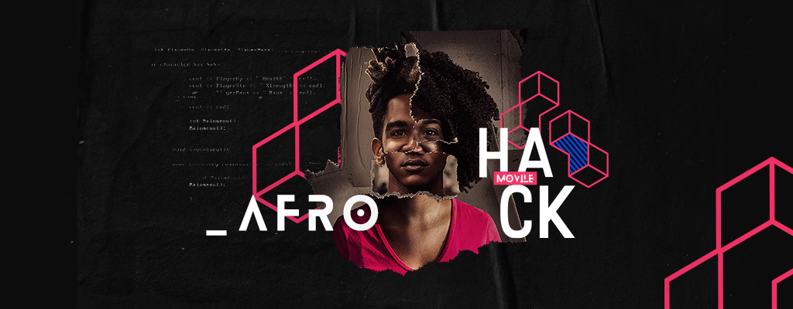

# Movile HACK-AFRO

Hackathon desenvolvido por pessoas negras, promovido pelo grupo MOVILE afim de viabilizar a "Educação/Desenvolvimento de jovens em situação de vulnerabilidade usando tecnologia."




## EDUCA **N**AÇÃO


# Iniciando o Projeto 

Para instalar as dependencias do projeto, execute os seguintes comandos no terminal:

```sh
npm install
```


Para compilar o arquivo style.scss para style.css, execute o comando:

```sh
npm run compile
```

Para monitorar a compilação do arquivo style.css execute:

```sh
npm run watch
```
Execute o arquivo abaixo para inicialização do projeto:

```sh
index.html
```

# Tecnologias Usadas

* HTML - Estrutura para a liguagem web
* Javascript - Linguagem de programação client-side
* SASS - Linguagem de folha de estilo

# Autores e Agradecimentos 

* **Isabela Silva**- Desenvolvendora Front-End 
* **Katherinne Rodrigues** - UI/UX Design 


